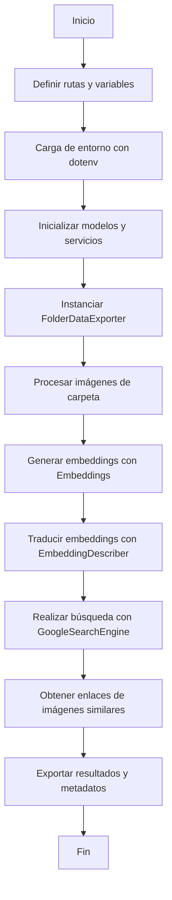

# 🔍 CustomImgSearch 

Herramienta para comparar imágenes de búsqueda contra tu colección personal. Al encontrar coincidencias, almacena las imágenes con los filtros aplicados.

## 📂 Estructura del Proyecto
```
app/
├── .devcontainer/
│ ├── Dockerfile
│ ├── devcontainer.json
│ └── docker-compose.yml
├── .vscode/
│ └── settings.json
├── scripts/
│ └── setup_git_config.sh
├── src/
│ ├── common/
│ │ ├── project_tree.py
│ │ └── utils.py
│ ├── module_embeddings/
│ │ ├── _moduleDoc.md
│ │ ├── class_embeddingDescriber.py
│ │ ├── class_embedinnizer.py
│ │ ├── utils_embeddings.py
│ │ └── verify_img_preprocessing.ipynb
│ ├── module_folder_data_explorer/
│ │ └── class_folderDataExporer.py
│ ├── module_img_metadata_extractor/
│ │ ├── class_metadataExtractor.py
│ │ └── utils_metadataExtractor.py
│ └── module_search_engine/
│ ├── __doc.md
│ └── class_searchEngine.py
├── test/
│ ├── test_debug_import.py
│ ├── test_embeddings_module.py
│ ├── test_folderDataExplorer_module.py
│ ├── test_module_img_metadata_extractor.py
│ └── test_search_module.py
├── .env
├── .env-example
├── .gitignore
├── LICENSE
├── README.md
├── estructura.txt
└── requirements.txt
```


## 🔄 Flujo de Trabajo del Proyecto



⚙️ Configuración de Git
1. Clonar el repositorio
```bash
git clone https://github.com/yourusername/CustomImgSearch.git
```

2. Configurar variables de entorno
Copiar el archivo .env de ejemplo:

```bash
cp .env-example .env
```

Editar el archivo .env con tus credenciales:

```env
GIT_USER_NAME=TuUsuarioGitHub
GIT_USER_EMAIL=tu-email@example.com
```
1. Ejecutar script de configuración
```bash
chmod +x scripts/setup_git_config.sh  # Si es necesario dar permisos
./scripts/setup_git_config.sh
```
📌 Notas Importantes
✅ Seguridad: El archivo .env está incluido en .gitignore para evitar exposición de credenciales

👥 Colaboración: Cada usuario debe:

Crear su propio .env

Ejecutar el script de configuración

Mantener actualizado su fork/branch

🔄 Los commits se atribuirán automáticamente al usuario configurado en .env

Nota sobre el diagrama: El diagrama Mermaid muestra el flujo principal de procesamiento de imágenes, no está relacionado con la configuración de cuentas GitHub.
